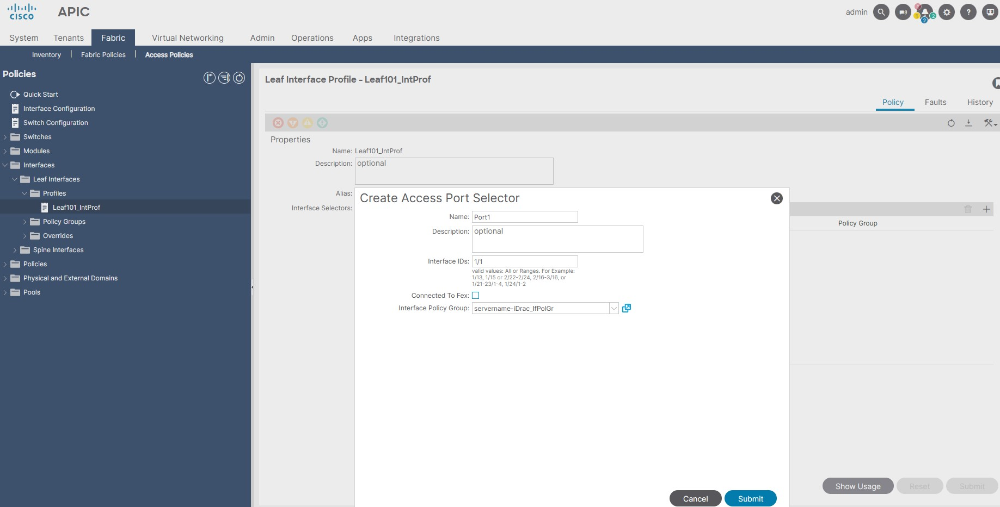
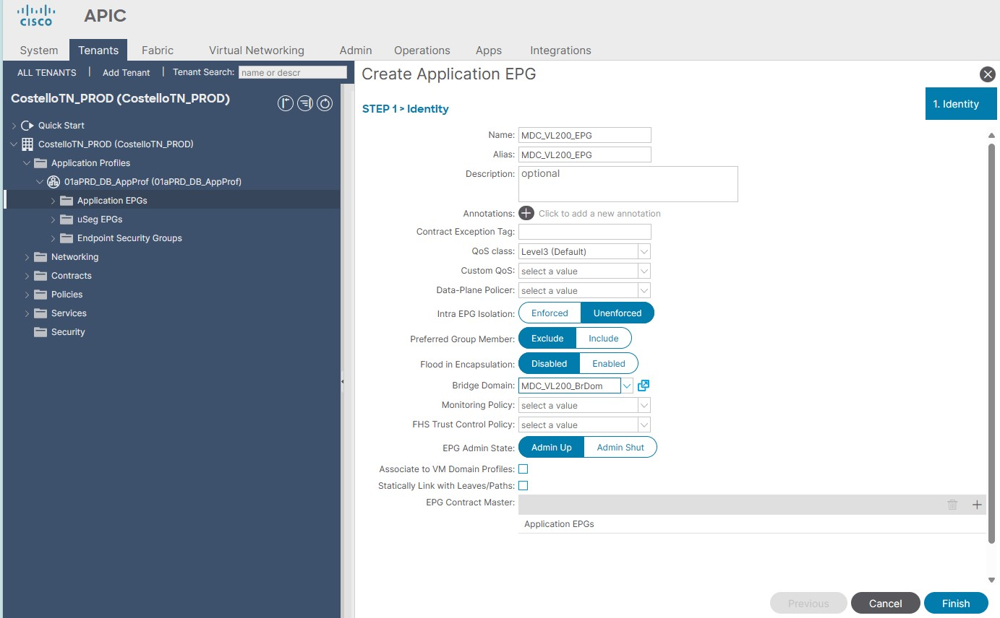

# ACI Automation

### SSH to APIC 
```
apic1# bash
To run a command as administrator (user "root"), use "sudo <command>".
See "man sudo_root" for details.

bash: warning: setlocale: LC_ALL: cannot change locale (en_US.UTF-8): No such file or directory
admin@apic1:~> show fabric membership
This command is being deprecated on APIC controller, please use NXOS-style equivalent command
clients:
serial-number  node-id  node-name  model        role   ip              decomissioned  supported-model
-------------  -------  ---------  -----------  -----  --------------  -------------  ---------------
TEP-1-104      101      spine-101  N9K-C9508    spine  10.0.128.65/32  no             yes
TEP-1-103      102      spine-102  N9K-C9508    spine  10.0.128.66/32  no             yes
TEP-1-101      201      leaf-201   N9K-C9396PX  leaf   10.0.128.64/32  no             yes
TEP-1-102      202      leaf-202   N9K-C9396PX  leaf   10.0.128.67/32  no             yes

apic1# fabric
101  102  201  202  leaf-201  leaf-202  spine-101  spine-102
apic1# fabric 201,202 show vpc

apic1# fabric 201,202 show vrf

apic1# bash
admin@apic1:~> attach leaf-202

```

For APIC API we will need to Enable Debug Info from the TOP cornder right gear ICON. Once that is enable you will be able to see the Current MO in the little bar on the bottom.
Ex: insieme.stromboli.model.def.fvTenant[uni/tn-Costello]

Once you Enable Debug Info you can go to https://<apic1>/visore.html#/
Class or DN or URL: fvTenant    then Run Query

- To Leak routes between Tenants you use the common Tennat.
- MGMT Tenant to manage the system, APIC want's to talk to vCenter it will use MGMT VRF. 
- INFRA Tenant is where the IS-IS is running and everything for the ACI infra. You don't want to touch this.


## ACI GUI Configuration

## Part 1
### Physical

 - Actual Wire Connection

          - Physical Domain - Bare Metal Server (VLAN-10)
          - VMM Domain - Virtualized Server (VLAN-20-30; VLAN-40-50)
          - External Bridged Domains - L2 Switch (VLAN-80-90)
          - L3 Domain - L3 Router - (VLAN-60-70)
          - SAN Switch - Fibre Channel Domains (VSAN 101)

## Part 2
### Logical

 - Tenant, EPG, BD, Contract, etc.


## Physical Configuration

I will create a pool of VLANs which will be used as ENCAP VLANs on access ports of the Leafs, for the simplicity here, I’m just picking all the VLANs there are:

1. Create VLAN Pool: Fabric > Access Policies > Pools > VLAN > Right Click Create VLAN Pool  (CostelloTN_VlanPool)

                                1.1 Allocation Mode: Static Allocation
                                1.2 Click + Encap Blocks to add the VLAN Range
                                            1.2.1 Range: VLAN Range 100-300
                                            1.2.2 Allocation Mode: Static Allocation


After VLAN pool is created, we configure physical domain which will use that VLAN pool. There already is a “phys” domain so we just configure the new pool to be used in it:

2. Create Physical and External Domains: Fabric > Access Policies > Physical and External Domains > Physical Domains > Right Click Create Physical Domain (CostelloTN_PhyDom)

                                2.1 Select VLAN Pool Created at Step 1 CostelloTN_VlanPool


The domain is now ready to be used inside AAEP (Attachable Access Entity Profile). Don’t ask, this AAEP, related to configured domain in it is used in every EPG later on. In that way, interface configuration is able to be build and pushed to the switch. I see that AAEP as a pivot – policy connecting object, or maybe as a Primary Key in Relational database as the ACI config seems to be structured just like a relational database.

3. Create Attachable Access Entity Profiles (AAEP): Fabric > Access Policies > Policies > Global > Attachable Access Entity Profile > Right Click Create (CostelloTN_AAEProf)
              
                                3.1 Click + to add attach the Domain that we created at the Step2 CostelloTN_PhyDom
                                3.2 For the rest we let them like that for now. Next and Finish.


4. Create Interface Policy: Fabric > Access Policies > Policies > Interface 
                                
                                4.1 Create CDP Interface, etc
                                4.2 In my version they were some defaults that I will use where is already enable. I don't have to configure anything at this step. ACI 6.0(3d)

Now we create Leaf Interface Profiles, objects that will be created only once and will represent the Interfaces of each Leaf. Later when you would need a new port configured on ACI, you will just add Interface Selector inside one of the Leafs Interface Profiles.

5. Create Interface Profile: Fabric > Access Policies > Interfaces > Leaf Interfaces > Profile > Right Click Create (Leaf101_IntProf), then Submit without adding Interface Selectors.
                                
                                5.1 Now we create Leaf Interface Profiles, objects that will be created only once and will represent the Interfaces of each Leaf. Later when you would need a new port configured on ACI, you will just add Interface Selector inside one of the Leafs Interface Profiles.

6. Create Access Interface Policy Group: Fabric > Access Policies > Interfaces > Leaf Interfaces > Policy Groups > Here we got 3 options:
                             
                                6.1 Leaf Access Port (Access Port) > Right Click Create
                                    6.1.1 Name (servername-iDrac_IfPolGr), Description - Server port description usually.
                                    6.1.2 Attach Entity Profile Created at Step 3 CostelloTN_AAEProf
                                    6.1.3 Select CDP enable, LLDP enable, Link Level Policy 10G..., Submit
                                6.2 PC Interface (Port-Channel)
                                6.3 VPC Interface (For LACP between two Leaf Switches)
                                6.4 Notes: Policy Group will be configured once for each type of single port configuration and once for each vPC configuration, because vPC config needs its own ID so it cannot be reused. Note that the most important think that you need to configure is the AAEP in the end because without it all other config done here will simply not be pushed to the Leaf. Most important is CDP-Enable, LLDP-Enable, 10G or 1Ginterface...


7. Create VPC Domain: This can be created once you create your ACI fabric or after. When you configuring vPC interface teaming you first need to have vPC domain configured which is done for each two pair of vPC Leafs: Fabric > Access Policies > Policies > Switch > Virtual Port Channel Default.

8. Create VPC Interface with LACP Policy Group: Fabric > Access Policies > Interfaces > Leaf Interfaces > Policy Groups > VPC Interface 

After you define the vPC domain, you can go back and configure the vPC Interface Policy Group. Please remember, this one is done separately for each vPC port pair and cannot be reused later for other few ports in another vPC config.

The thing to note here is that you need Port Channel Policy inside this one, everything else is the same as for normal access port Policy Group:
                              
                                8.1 VPC Interface Right Click Create, Name (servername-db_vPC)
                                8.2 Description each server port.
                                8.3 Attached Entity Profile. Attach the AAEP created at step 3.
                                8.4 CDP-Enable, LACP-Enable, Link-10G
                                8.5 Port Channel Policy - system-lacp-active
                                
9. Create Leaf Switch Profile: Now we are ready to create Switch Selector, objects that will be created only once and which will represent Leafs and will be a placeholder for Leaf Interface configuration. I created one of them for each of the first Leafs and one for first vPC Leaf pair. Added into them Leaf ID and Interface Selector Profile created above.
                                
                                9.1 Fabric > Access Policies > Switches > Leaf Switches > Profiles > Right Click Create
                                9.2 Name: Leaf101_Prof
                                9.3 Leaf Selector +: Leaf Name Leaf101; Blocks 101; Policy group Empty.
                                9.4 Associations: Interface Selector Profiles > Leaf101_IntProf created at step 5.


10. Configure our first Leaf Trunk Interface: Now we are all set to configure our first Leaf port as a 10G optical port with CDP on and LLDP on. We just enter the Leaf Interface profile of Leaf-101 and add the port 1 configuration with 1/1 selector and 10G access port Interface Policy Group. After that, the port will become active as soon we map the first EPG to it.

                                10.1 Fabric > Access Policies > Interfaces > Leaf Interfaces > Profiles > Leaf101_IntProf that was already created at step 5.
                                10.2 Interface Selector + : Create Access Port Selector; Name Port1; Interface ID's 1/1
                                                    10.2.1 Interface Policy Group servername-iDrac_IfPolGr created at step 6.
                                10.3 Notes: In order to get the configuration pushed from APIC to the port, we still have a lot to do. We need to create ACI Application Policy which will define the port to EPG Membership and define the VLANs that are allowed to cross that trunk port.


## Logical Configuration

EPG is an Endpoint group which represents a group of endpoints (VM on a hypervisor connected to ACI Leaf or a baremetal server connected the same way). Those endpoints, if placed in the same EPG are allowed to communicate between them selfs. In order for two endpoints from two different EPGs to communicate, those two EPG need to be connected with a contract which allows same IP/TCP/UDP/ICMP or some other communication between them. 
In order to get some endpoints mapped inside some EPGs we need to configure the ports for it (all the config above) plus Application policy below.

1. Creating a Tenant: Tenants > Add Tenant  (CostelloTN_PROD)

2. Create a VRF: Tenants > CostelloTN_PROD > Networking > VRFs > Right Click Create VRF (01aPRD_DB_VRF)

                                2.1 Un-check Create A Bridge Domain (We will do this at the next step)
     

Create first Bridge Domain representing a VLAN L2 Broadcast Domain. Take care to give it a name and select the proper VRF in which it will reside, in our case the only VRF GRT (global routing table):

3. Create a Bridge Domain (BD): Tenants > CostelloTN_PROD > Networking > Bridge Domains > Right Click Create (MDC_VL200_BrDom)

BD being an L2 domain it still provides the means to limit the communication between members of same BD but placed in different EPGs (part of that same BD). Something like private VLANs but with the option to define some kind of Access-List and let some traffic flow between them and some not (and everything inside same L2 domain). Strange!, but it’s a way to create microSegmented configuration later on.

                                3.1 VRF > Select the VRF created at Step 2 > 01aPRD_DB_VRF
                                
4. Create APP Profile: Tenants > CostelloTN_PROD > Application Profiles > Right Click Create (01aPRD_DB_AppProf)

5. Create Application EPGs: Tenants > CostelloTN_PROD > Application Profiles > 01aPRD_DB_AppProf > Application EPGs > Right Click Create (MDC_VL200_EPG)
                                
                                5.1 select the Bridge Domain Created at step 3 MDC_VL200_BrDom


EPG needs domain association in order to pull all the interface and Leaf configuration done above in Leaf and Interface selector profiles so it knows got to physically configure the interfaces that will be mapped to that EPG later on:

6. Add Domain to EPG: Tenants > CostelloTN_PROD > Application Profiles > 01aPRD_DB_AppProf > Application EPGs >  MDC_VL200_EPG > Domains >Right Click Add Physical Domain Association > Select CostelloTN_PhyDom


After domain association we can continue and create our first interface to EPG mapping (Static Ports) which will effectively take whole interface configuration in ACI policy model plus the Application policy and encap VLAN ID and push that to Leaf interface:

8. Static Port Map to EPG: Tenants > CostelloTN_PROD > Application Profiles > 01aPRD_DB_AppProf > Application EPGs >  MDC_VL200_EPG > Right Click Create:
                                
                                7.1 Select Node Leaf-101
                                7.2 Path - 1/1 servername-eth0
                                7.3 Port Encap VLAN 200
                                7.5 Deployment Imeddiacy: Immediate 
                                7.6 Mode Trunk


## Verification:
```
apic1# config t
apic1(config)# leaf 101
apic1(config-leaf)# show running-config
# Command: show running-config leaf 101
# Time: Wed Apr 24 18:42:53 2024
  leaf 101
    interface ethernet 1/1
      # policy-group servername-iDrac_IfPolGr
      switchport trunk allowed vlan 200 tenant CostelloTN_PROD application 01aPRD_DB_AppProf epg MDC_VL200_EPG
      exit
    router bgp 65501
      exit
    exit
```

### Notes:

- Traffic inside the same EPG will be allowed by default and it will be bridged across the fabric overlay.
- Traffic to be routed between two EPGs that belong to different BDs need to have contracts applied to EPGs in Application Policy 
- Traffic to be bridged between EPGs that belong to the same BD need to have contracts applied to EPGs in the Application Policy.

https://howdoesinternetwork.com/2019/setting-up-cisco-aci-from-scratch
